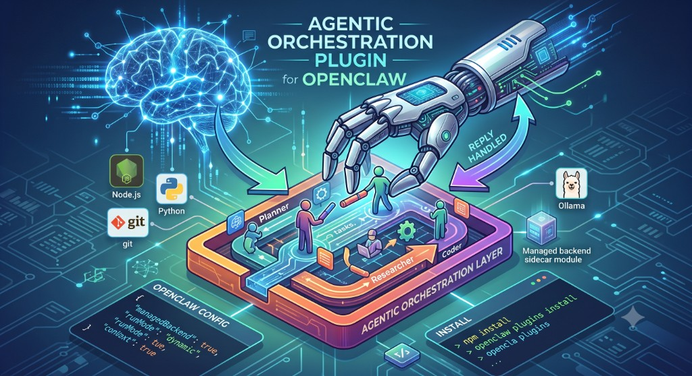

# OpenClaw ↔ Agentic Orchestration Plugin



Your OpenClaw agent handles one thing at a time. This plugin gives it a
**multi-agent brain** — a planner that breaks complex requests into steps,
routes each step to the right model, and returns one clean answer. Runs
entirely on your machine. Sets itself up automatically.

Backed by [agentic-orchestration](https://github.com/zlatko-lakisic/agentic-orchestration)
— a CrewAI-based orchestration engine that supports Ollama (local), OpenAI,
Anthropic, and Hugging Face, picked per task from a YAML catalog.

## What you get

| Before | After |
|---|---|
| Single LLM handles everything in one context window | Planner + specialist agents, each with a focused role |
| Complex or multi-step tasks get confused or truncated | Structured plan → sequential execution → one clean reply |
| One model for every task — expensive for simple requests | Local Ollama for fast tasks, cloud model for hard reasoning |
| Session memory is flat chat history | Persistent knowledge base and learning loop across conversations |
| OpenClaw shell-commands and tools run in one agent loop | MCP servers (Home Assistant, search, docs, custom) per agent per step |

## Example

You send from WhatsApp:

> "Summarise this week's open GitHub issues in my repo and suggest priorities."

Without this plugin, OpenClaw passes the full request to one LLM and hopes
for the best.

With this plugin, the planner breaks it into steps:

1. **Research agent** — fetches open issues via the GitHub MCP server
2. **Triage agent** — scores each issue by severity and effort
3. **Writing agent** — formats a structured summary

You get one reply with a prioritised list. The whole thing runs locally if
you have Ollama; no data leaves your machine.

> **Zero-setup backend.** On first run the plugin downloads, installs, and
> starts the agentic-orchestration engine for you — no manual Python setup,
> no cloning repos. If you already have a local checkout it will use that
> instead. To run the backend yourself, set `managedBackend: false`.

## Requirements

If you're already running OpenClaw on a modern machine, you likely have
everything needed. The plugin will tell you if something is missing during
first bootstrap.

- **OpenClaw gateway ≥ 2026.3.24-beta.2**
- **Node.js 22.19+**
- **Python 3.12+** — `python3.12` must be on PATH (the managed web server creates its own venv)
- **Network access to GitHub** — used on first run to download the backend source archive
- **Local inference:** [Ollama](https://ollama.com) with any model e.g. `llama3.2`
  — or set OpenAI / Anthropic credentials in OpenClaw / your environment instead

## Install

```bash
openclaw plugins install clawhub:@zlatko-lakisic/openclaw-agentic-orchestration
```

Then configure and restart — see [OpenClaw config](#openclaw-config) below.

> **Note:** The managed backend requires `agentic-orchestration-web` to expose
> `/api/v1/orchestrate`. When that route is missing from the cloned checkout,
> the plugin **injects it automatically** from `patches/` during bootstrap
> (`managedBackend: true`). Prefer a local checkout that already includes the
> endpoint (see `preferLocalCheckout` / `AGENTIC_ORCHESTRATION_ROOT`).

## OpenClaw config

```json
{
  "plugins": {
    "entries": {
      "agentic-orchestration": {
        "config": {
          "managedBackend": true,
          "timeoutMs": 120000,
          "runMode": "dynamic",
          "sessionPassthrough": true,
          "fallbackOnError": false
        },
        "hooks": {
          "allowConversationAccess": true
        }
      }
    }
  }
}
```

Optional: set `"apiKey": "your-secret-token"` in that `config` object and the same value as `AGENTIC_ORCHESTRATE_API_KEY` on the web server.

**`allowConversationAccess: true` is mandatory.**

Then restart the gateway:

```bash
openclaw gateway restart
```

Verify the plugin loaded and the hook is registered:

```bash
openclaw plugins inspect agentic-orchestration --runtime --json
```

Expected: output shows the plugin is active. If the backend is still bootstrapping, wait until the gateway log prints that the managed backend is ready before testing.

On service start the plugin will:

1. Prefer a **local checkout** of `agentic-orchestration` if found (`AGENTIC_ORCHESTRATION_ROOT`, then sibling dirs)
2. Otherwise **download** the GitHub source archive into `<openclaw-state>/agentic-orchestration/repo`
3. Inject `/api/v1/orchestrate` into `server.mjs` if upstream does not have it yet
4. Map credentials: OpenClaw / env OpenAI·Anthropic keys if available, else **Ollama defaults**
5. Start `agentic-orchestration-web` in a worker thread and wait for `/api/ping` (the web server creates the Python venv / installs deps)

## How it works

1. OpenClaw loads the plugin and starts the `agentic-orchestration-backend` service.
2. The managed backend prepares the repo + deps and listens on `:3847`.
3. `before_agent_reply` POSTs `{ text, sessionId, … }` to `/api/v1/orchestrate`.
4. Hook returns `{ handled: true, reply: { text } }` — OpenClaw skips its own model call entirely. No OpenClaw model tokens are consumed.

> OpenClaw **≥ 2026.7** `before_agent_reply` uses `{ handled: boolean, reply?: { text } }`
> (not a flat `{ reply: string }`). Returning without `handled: true` lets the native LLM run.

## Session continuity

With `sessionPassthrough: true`, OpenClaw’s `sessionKey` is sent as `sessionId`. On `/reset`, `before_reset` marks the next turn with `resetSession: true`.

## Config reference

| Key | Default | Description |
|---|---|---|
| `managedBackend` | `true` | Auto install + start the orchestration backend |
| `repoUrl` | `https://github.com/zlatko-lakisic/agentic-orchestration` | Clone source when no local checkout |
| `installDir` | `<state>/agentic-orchestration` | Managed backend root override |
| `preferLocalCheckout` | `true` | If `AGENTIC_ORCHESTRATION_ROOT` is set, use it. Otherwise look for `../agentic-orchestration` relative to the plugin directory (also checks `~/Projects/agentic-orchestration`). |
| `autoUpdate` | `true` | Re-download source archive on start (downloaded checkouts only) |
| `backendHost` / `backendPort` | `localhost` / `3847` | Managed server bind |
| `bootstrapTimeoutMs` | `600000` | Clone + deps + health wait |
| `endpoint` | managed URL | Used when `managedBackend=false` |
| `apiKey` | *(none)* | Bearer for `/api/v1/orchestrate` |
| `timeoutMs` | `120000` | Per-request HTTP budget |
| `runMode` | `dynamic` | `dynamic` \| `dynamic-iterative` |
| `sessionPassthrough` | `true` | Forward OpenClaw session ID |
| `fallbackOnError` | `false` | Fall through to native LLM on failure |
| `verboseCrew` | `false` | CrewAI verbose |
| `syncOpenClawMcp` | `true` | Map OpenClaw `mcp.servers` → AO MCP YAML fragments (AO launches them) |
| `injectOpenClawContext` | `true` | Inject workspace bootstrap / memory / skills into each orchestrate prompt |
| `bridgeOpenClawTools` | `true` | Host `openclaw_bridge` MCP (browser, exec, nodes, memory via OpenClaw) |
| `bridgePort` | `3848` | Loopback control-plane port for the tool bridge |
| `fallthroughAutomation` | `true` | Let native OpenClaw handle cron/heartbeat sessions |
| `selectedAgentProviderIds` | `["ollama_llama3_2_1b"]` | Optional planner agent-provider allowlist |

### OpenClaw MCP → AO

On service start the plugin reads `mcp.servers` from OpenClaw config and writes AO provider fragments under:

`<openclaw-state>/agentic-orchestration/openclaw-mcp-providers/openclaw_<name>.yaml`

The managed backend gets `AGENTIC_EXTRA_MCP_PROVIDERS_PATH` pointing at that directory, so the planner can select those MCPs like any built-in AO provider. Stdio servers are spawned by AO (not attached to OpenClaw’s process). OAuth and SSE transports are skipped with a log warning.

Add MCP servers with OpenClaw as usual:

```bash
openclaw mcp set docs '{"command":"uvx","args":["context7-mcp"]}'
openclaw gateway restart
```

Then ask for something that needs that server’s tools.

### OpenClaw context + tool bridge

On each chat turn the plugin can:

1. **Inject context** — workspace `AGENTS.md` / `SOUL.md` / memory / skill summaries into the orchestrate prompt
2. **Bridge tools** — expose MCP provider `openclaw_bridge` that proxies OpenClaw `browser`, `exec`, `memory_*`, and paired `nodes` through a loopback control plane (OpenClaw keeps policy/approvals)
3. **Fall through** — cron/heartbeat sessions skip AO so native automation tools still work

Disable individually with `injectOpenClawContext`, `bridgeOpenClawTools`, or `fallthroughAutomation` set to `false`.

> **First-run bootstrap** (archive download + web-server venv/pip install) typically takes
> **3–10 minutes** depending on network speed. The gateway log will show progress.
> Do not kill the process — wait for the managed backend ready message in the logs
> (e.g. `Managed backend ready at …`).

## Pitfalls

| Symptom | Fix |
|---|---|
| Hook never fires | Set `hooks.allowConversationAccess: true` |
| `LLM request failed: network connection error` / ECONNREFUSED `:3847` | OpenClaw ≥ 2026.7 may call the `agentic` OpenAI proxy instead of `before_agent_reply` for user turns. Set `backendHost` / `backendPort` (or `endpoint`) to your AO web (`30487` on Jetson NodePort). Paste a local key: `printf agentic-orchestration-local \| openclaw models auth --agent main paste-api-key --provider agentic` |
| Backend not ready | Check gateway logs; first bootstrap can take several minutes |
| First run takes forever | Bootstrap downloads the backend archive and the web server creates a Python venv — allow 3–10 minutes. Watch gateway logs for progress. |
| Ollama planner fails | `ollama pull llama3.2` (or set OpenAI/Anthropic keys) |
| Want external server only | `managedBackend: false` |
| Python venv fails | Install Python **3.12+** (`python3.12` on PATH) |

## Manual / external backend

```json
{
  "managedBackend": false,
  "endpoint": "http://localhost:3847/api/v1/orchestrate"
}
```

Then run `agentic-orchestration-web` yourself (must expose `/api/v1/orchestrate`).

## Develop

```bash
npm install
npm run build
npm test
```

### Install from local checkout

```bash
cd /path/to/agentic-orchestration-openclaw
npm install && npm run build
openclaw plugins install file:$(pwd)
```

Also available from GitHub:

```bash
openclaw plugins install github:zlatko-lakisic/agentic-orchestration-openclaw
```

## Publish to ClawHub

```bash
npm run build
clawhub package publish zlatko-lakisic/agentic-orchestration --dry-run
clawhub package publish zlatko-lakisic/agentic-orchestration
```

## License

Apache-2.0

## Security

See **[SECURITY.md](SECURITY.md)** for how to report vulnerabilities, the plugin threat model (managed backend, conversation hooks, HTTP bridge), and operator hardening. Engine issues: [agentic-orchestration/SECURITY.md](https://github.com/zlatko-lakisic/agentic-orchestration/blob/main/SECURITY.md).

